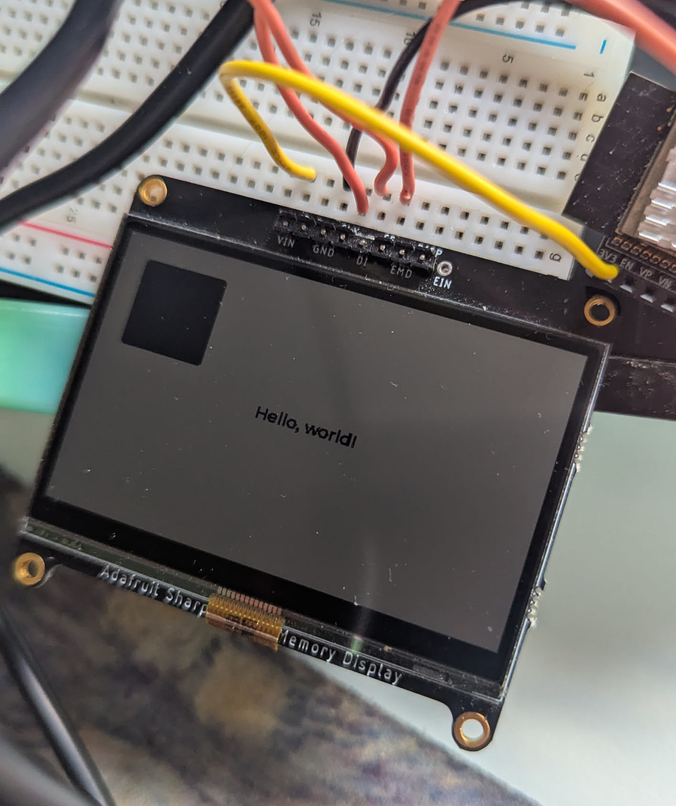

## Monochrome display demo

This is just a repo showing how to get the SHARP memory display working with LVGL 9.x running on an ESP32 with esp-idf.

In my case I'm using the LS027B7DH01 model which is 240x400 pixels.

Link to the datasheet [here](https://mm.digikey.com/Volume0/opasdata/d220001/medias/docus/1272/LS027B7DH01_Rev_Jun_2010.pdf)

Driver is based off of the 7.x version from [here](https://github.com/lvgl/lv_drivers/blob/master/display/SHARP_MIP.c) with modifications to work in LVGL 9.x

Most notably:
- I use a second display buffer that contains the extra bytes required to address each line, headers, etc, since the protocol bytes would otherwise collide with the pixel data. This means it has to copy them over line by line when it flushes the display.
- There are 8 extra bytes representing a color pallete at the beginning of the draw buffer that you have to skip when using `LV_COLOR_FORMAT_I1` which is the monochrome format.
- There is no more sharp_mip_set_px function since that callback no longer exists in 9.x

Example:

